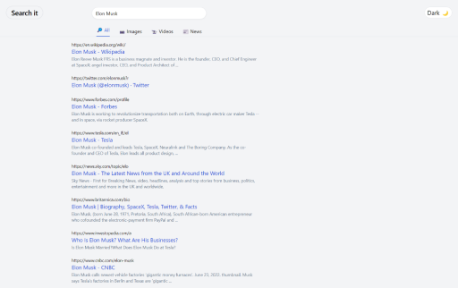

# Search it 

**Website Link- [https://search-it-web.netlify.app/](https://search-it-web.netlify.app/)**

**'Search it'** allows you to search anything acrosss the internet, be it images, blogs, videos, or news.

'Search it' has the functionalities of allowing the user to search on any topic and also playing the videos on the same search area.

It has both **'Light'** and **'Dark'** Modes making it user friendly.

The website is built on **React** and the search results are fetched using the **API** - [Google Search](https://rapidapi.com/apigeek/api/google-search3?utm_source=youtube.com%2FJavaScriptMastery&utm_medium=DevRel&utm_campaign=DevRel) by [apigeek](https://rapidapi.com/user/apigeek).

##### The Results

        
